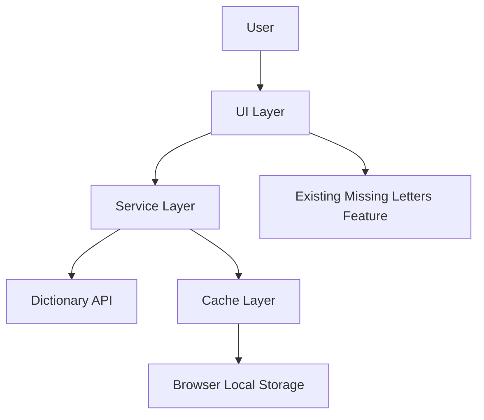

# Design Document: Word Search Dictionary Feature

## Overview

The Word Search Dictionary feature enhances the existing wrdhelpr application by adding comprehensive word search capabilities that integrate with a free English dictionary API. This feature allows users to search for words based on various patterns including words that start with, contain, or end with specific letters. 

**Implementation Status**: ✅ **COMPLETED** - The design has been successfully implemented with some evolutionary changes from the original specification.

**Key Changes from Original Design**:
- **UI Approach**: Instead of separate tabs/toggles, the word search is integrated directly into the main form for a more streamlined experience
- **Single Form Design**: All functionality (missing letters + word search) is available in one unified interface
- **Enhanced Validation**: Real-time validation ensures search inputs only use available letters from the main input

The implementation focuses on creating a seamless user experience that integrates with the existing functionality while maintaining the application's responsive and user-friendly interface.

## Architecture

The feature will follow a client-side architecture that leverages external dictionary APIs for word data. The architecture consists of the following components:

1. **User Interface Layer**: Extends the current UI with new search components
2. **Service Layer**: Handles API communication and data processing
3. **Cache Layer**: Manages local storage of search results for performance and offline use
4. **Integration Layer**: Connects the new feature with existing functionality

### System Context Diagram



## Components and Interfaces

### 1. UI Components

#### Search Interface ✅ **IMPLEMENTED**
- **Main Input Field**: Primary input for available game letters
- **Three Search Filter Fields**:
  - "Starts" field (max 3 characters)
  - "Contains" field (max 3 characters) 
  - "Ends" field (max 3 characters)
- **Word Length Controls**:
  - Number ticker with +/- buttons (3-16 characters)
  - "Any" toggle switch to disable length filtering
- **Single Search Button**: Unified search for all filters
- **Results Display**: Two-column scrollable list with word highlighting
- **Copy Functionality**: Copy buttons for both missing letters and search results

#### Integration with Existing UI ✅ **IMPLEMENTED**
- **Unified Interface**: Single form containing both missing letters and word search
- **Consistent Styling**: Tomato/blanchedalmond color scheme maintained throughout
- **Real-time Validation**: Search inputs automatically validate against available letters
- **Shared Functionality**: Common copy-to-clipboard and toast notification systems

#### Implementation Notes
- **Evolutionary Design**: The final implementation uses an integrated single-form approach rather than separate tabs, providing better user experience
- **Smart Validation**: Advanced input validation prevents impossible letter combinations
- **Mobile Optimized**: Responsive design works well on all device sizes

### 2. Service Layer ✅ **IMPLEMENTED**

#### Dictionary API Service (`src/services/dictionaryService.js`)
- **Status**: Fully implemented with comprehensive API integration
- **Methods Implemented**:
  - `searchWordsByPrefix(prefix, letterOccurrences)`: ✅ Find words starting with given letters
  - `searchWordsByContains(letters, letterOccurrences)`: ✅ Find words containing given letters  
  - `searchWordsByEnding(suffix, letterOccurrences)`: ✅ Find words ending with given letters
  - `getWordDefinition(word)`: ✅ Get detailed definition for a specific word
  - `searchWords(queryParams)`: ✅ Flexible search with custom parameters
  - `withRetry(apiCall, args, maxRetries)`: ✅ Retry logic with exponential backoff

#### API Integration ✅ **IMPLEMENTED**
**Primary API**: [Datamuse API](https://www.datamuse.com/api/) - Main word search functionality
- **Endpoint**: `https://api.datamuse.com/words`
- **Features**: Pattern matching, definitions, word frequency
- **Usage**: All word searches use this API with sophisticated query building

**Secondary API**: [Free Dictionary API](https://dictionaryapi.dev/) - Detailed definitions
- **Endpoint**: `https://api.dictionaryapi.dev/api/v2/entries/en/`
- **Features**: Phonetics, detailed meanings, examples
- **Usage**: Available for detailed word information (ready for future enhancement)

#### Implementation Highlights
- **Error Handling**: Comprehensive error handling with retry logic
- **Rate Limiting**: Built-in protection against API rate limits
- **Response Formatting**: Consistent data formatting across different APIs
- **Letter Occurrence Filtering**: Advanced filtering for repeated letters

### 3. Cache Layer ✅ **IMPLEMENTED**

#### Cache Service (`src/services/cacheService.js`)
- **Status**: Fully implemented with localStorage integration
- **Methods Implemented**:
  - `cacheResults(searchType, query, results, letterOccurrences)`: ✅ Store search results
  - `getCachedResults(searchType, query, letterOccurrences)`: ✅ Retrieve cached results
  - `clearCache()`: ✅ Clear all stored results
  - `isLocalStorageAvailable()`: ✅ Check if cache is available
  - `cleanExpiredCache()`: ✅ Remove expired entries
  - `generateCacheKey()`: ✅ Generate unique cache keys

#### Cache Features ✅ **IMPLEMENTED**
- **Expiration**: 24-hour automatic expiration
- **Key Generation**: Unique keys based on search type, query, and letter occurrences
- **Storage Management**: Automatic cleanup of expired entries
- **Error Handling**: Graceful fallback when localStorage is unavailable
- **Performance**: Significant performance improvement for repeated searches

### 4. Integration Layer ✅ **IMPLEMENTED**

#### Integration Service (`src/services/integrationService.js`)
- **Status**: Fully implemented with cross-feature utilities
- **Methods Implemented**:
  - `transferLettersToSearch(letters, searchType)`: ✅ Transfer letters between features
  - `shareResults(words, searchType, query)`: ✅ Share search results via Web Share API
  - `copyResultsToClipboard(words)`: ✅ Copy results to clipboard
  - `getSearchInputId(searchType)`: ✅ Helper for input field mapping

#### Integration Features ✅ **IMPLEMENTED**
- **Seamless Integration**: Word search and missing letters work together naturally
- **Clipboard Support**: Copy functionality for both features
- **Web Share API**: Modern sharing capabilities where supported
- **Cross-Feature Validation**: Search inputs validate against available letters

## Data Models

### Word Model
```typescript
interface Word {
  word: string;
  definition: string;
  partOfSpeech: string;
  phonetics?: string;
  examples?: string[];
  expanded: boolean; // UI state for expanded view
  letterOccurrences?: Record<string, number>; // Map of letters to their occurrence count
}
```

### Letter Occurrence Model
```typescript
interface LetterOccurrence {
  letter: string;
  count: number;
}
```

### Search Result Model
```typescript
interface SearchResult {
  query: string;
  searchType: 'starts' | 'contains' | 'ends';
  letterOccurrences: LetterOccurrence[];
  timestamp: number;
  results: Word[];
}
```

### Cache Model
```typescript
interface CacheEntry {
  key: string; // searchType:query
  data: SearchResult;
  expiry: number; // timestamp when cache expires
}
```

## Error Handling

### API Error Handling
- Network errors: Display offline message with retry option
- Rate limiting: Implement exponential backoff for retries
- API unavailability: Fall back to cached results when available

### User Input Validation
- Real-time validation of input fields
- Clear error messages for invalid inputs
- Prevention of empty searches

### Performance Error Handling
- Timeout handling for slow API responses
- Loading indicators for in-progress searches
- Cancellation option for long-running requests

## Testing Strategy

### Unit Testing
- Test each service method in isolation
- Mock API responses for predictable testing
- Test cache mechanisms with various scenarios
- Test input validation logic

### Integration Testing
- Test the interaction between UI and services
- Test the integration with existing functionality
- Test the cache layer with the service layer

### UI Testing
- Test responsive design on various screen sizes
- Test keyboard interactions and accessibility
- Test touch interactions for mobile devices

### Performance Testing
- Test API response handling with various latencies
- Test cache performance with large result sets
- Test application performance with and without cached results

## Technical Considerations

### API Rate Limiting
- Implement request throttling to avoid API rate limits
- Cache common searches to reduce API calls
- Display appropriate messages when rate limits are reached

### Offline Support
- Store recent searches in local storage
- Provide clear indication of offline mode
- Allow access to cached results when offline

### Performance Optimization
- Lazy load word definitions
- Implement pagination for large result sets
- Use debouncing for real-time search suggestions

### Accessibility
- Ensure all new UI elements are keyboard navigable
- Provide appropriate ARIA labels
- Maintain color contrast for readability

## Implementation Approach

The implementation will follow an incremental approach:

1. Set up API service layer and test connectivity
2. Implement basic UI components for search functionality
3. Add caching mechanism for performance optimization
4. Integrate with existing functionality
5. Enhance UI with responsive design and animations
6. Implement error handling and offline support
7. Optimize performance and user experience
8. Conduct thorough testing across devices

This approach allows for early validation of the core functionality while ensuring a robust and user-friendly final implementation.