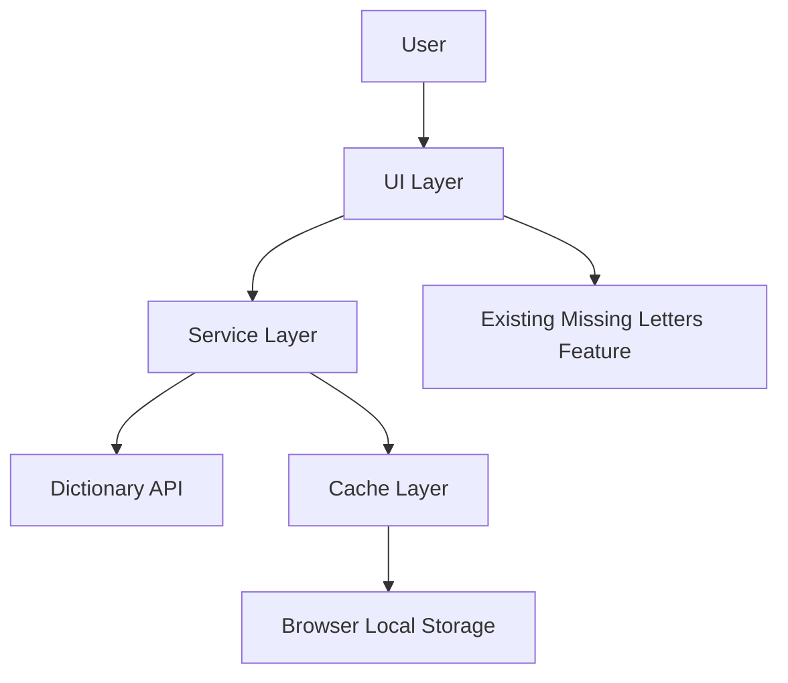

# Design Document: Word Search Dictionary Feature

## Overview

The Word Search Dictionary feature will enhance the existing wrdhelpr application by adding comprehensive word search capabilities that integrate with a free English dictionary API. This feature will allow users to search for words based on various patterns including words that start with, contain, or end with specific letters. The design focuses on creating a seamless user experience that integrates with the existing functionality while maintaining the application's responsive and user-friendly interface.

## Architecture

The feature will follow a client-side architecture that leverages external dictionary APIs for word data. The architecture consists of the following components:

1. **User Interface Layer**: Extends the current UI with new search components
2. **Service Layer**: Handles API communication and data processing
3. **Cache Layer**: Manages local storage of search results for performance and offline use
4. **Integration Layer**: Connects the new feature with existing functionality

### System Context Diagram



## Components and Interfaces

### 1. UI Components

#### Search Interface
- Three distinct search input fields:
  - "Starts with" search field
  - "Contains" search field
  - "Ends with" search field
- Letter occurrence selector for each letter in search inputs
  - Number input or dropdown to specify exact occurrences (1, 2, 3, etc.)
  - Visual indicator for letters with specified occurrences
- Search button for each search type
- Results display area with scrollable list
- Word detail expansion panel for definitions

#### Integration with Existing UI
- Tab or toggle system to switch between missing letters tool and word search
- Consistent styling with the existing application
- Shared copy-to-clipboard functionality

### 2. Service Layer

#### Dictionary API Service
- Interface for communicating with external dictionary APIs
- Methods:
  - `searchWordsByPrefix(prefix)`: Find words starting with given letters
  - `searchWordsByContains(letters)`: Find words containing given letters
  - `searchWordsByEnding(suffix)`: Find words ending with given letters
  - `getWordDefinition(word)`: Get detailed definition for a specific word

#### API Selection
We will integrate with the following free dictionary APIs:
1. **Primary API**: [Free Dictionary API](https://dictionaryapi.dev/) - Provides word definitions
2. **Secondary API**: [Datamuse API](https://www.datamuse.com/api/) - Provides word search capabilities

### 3. Cache Layer

#### Cache Service
- Interface for managing local storage of search results
- Methods:
  - `cacheResults(searchType, query, results)`: Store search results
  - `getCachedResults(searchType, query)`: Retrieve cached results
  - `clearCache()`: Clear stored results
  - `isCacheAvailable()`: Check if cache is available

### 4. Integration Layer

#### Integration Service
- Interface for connecting new features with existing functionality
- Methods:
  - `transferLettersToSearch(letters)`: Use missing letters in word search
  - `shareResults(words)`: Share search results

## Data Models

### Word Model
```typescript
interface Word {
  word: string;
  definition: string;
  partOfSpeech: string;
  phonetics?: string;
  examples?: string[];
  expanded: boolean; // UI state for expanded view
  letterOccurrences?: Record<string, number>; // Map of letters to their occurrence count
}
```

### Letter Occurrence Model
```typescript
interface LetterOccurrence {
  letter: string;
  count: number;
}
```

### Search Result Model
```typescript
interface SearchResult {
  query: string;
  searchType: 'starts' | 'contains' | 'ends';
  letterOccurrences: LetterOccurrence[];
  timestamp: number;
  results: Word[];
}
```

### Cache Model
```typescript
interface CacheEntry {
  key: string; // searchType:query
  data: SearchResult;
  expiry: number; // timestamp when cache expires
}
```

## Error Handling

### API Error Handling
- Network errors: Display offline message with retry option
- Rate limiting: Implement exponential backoff for retries
- API unavailability: Fall back to cached results when available

### User Input Validation
- Real-time validation of input fields
- Clear error messages for invalid inputs
- Prevention of empty searches

### Performance Error Handling
- Timeout handling for slow API responses
- Loading indicators for in-progress searches
- Cancellation option for long-running requests

## Testing Strategy

### Unit Testing
- Test each service method in isolation
- Mock API responses for predictable testing
- Test cache mechanisms with various scenarios
- Test input validation logic

### Integration Testing
- Test the interaction between UI and services
- Test the integration with existing functionality
- Test the cache layer with the service layer

### UI Testing
- Test responsive design on various screen sizes
- Test keyboard interactions and accessibility
- Test touch interactions for mobile devices

### Performance Testing
- Test API response handling with various latencies
- Test cache performance with large result sets
- Test application performance with and without cached results

## Technical Considerations

### API Rate Limiting
- Implement request throttling to avoid API rate limits
- Cache common searches to reduce API calls
- Display appropriate messages when rate limits are reached

### Offline Support
- Store recent searches in local storage
- Provide clear indication of offline mode
- Allow access to cached results when offline

### Performance Optimization
- Lazy load word definitions
- Implement pagination for large result sets
- Use debouncing for real-time search suggestions

### Accessibility
- Ensure all new UI elements are keyboard navigable
- Provide appropriate ARIA labels
- Maintain color contrast for readability

## Implementation Approach

The implementation will follow an incremental approach:

1. Set up API service layer and test connectivity
2. Implement basic UI components for search functionality
3. Add caching mechanism for performance optimization
4. Integrate with existing functionality
5. Enhance UI with responsive design and animations
6. Implement error handling and offline support
7. Optimize performance and user experience
8. Conduct thorough testing across devices

This approach allows for early validation of the core functionality while ensuring a robust and user-friendly final implementation.